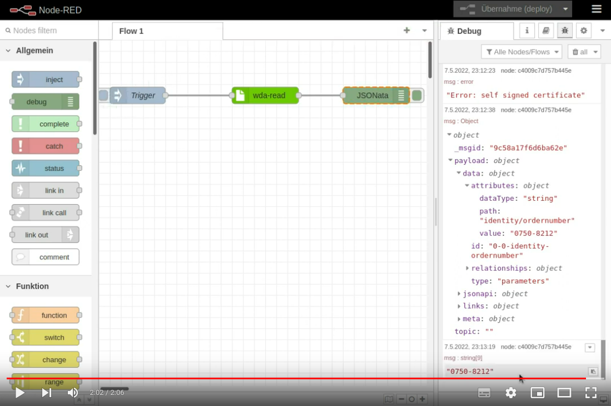

# node-red-wda

_**Note:** This repository contains a proof of concept to demonstrate
WDA integration into [Node-RED](https://nodered.org/). WDA (WAGO device acceess) is an API to access [WAGO](https://www.wago.com) PFC200 devices and is currently released as open beta. This repository was tested against PFC200 firmware 21 (03.09.04)._

## Usage

## Create Package

    npm pack

## Possible Future Improvements

This repository contains a proof of concept an therefore only a limited
base functionality. Actually, only reading single WDA parameters is supported yet.

Possible future improvements are:

- use token based authentication  
  _(the current implementation supports only basic authentication, which tends to be slow compared to token based authentication)_
- reading multiple parameters at once
- writing parameter values
- execute methods
- WDA file handling
